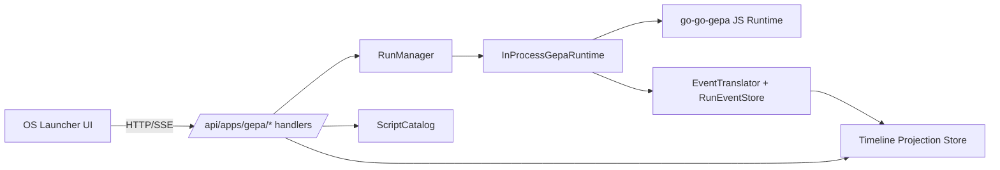
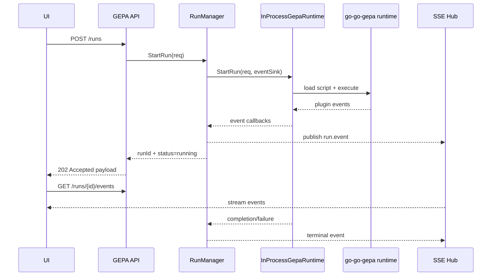
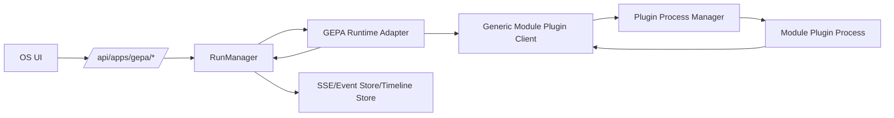
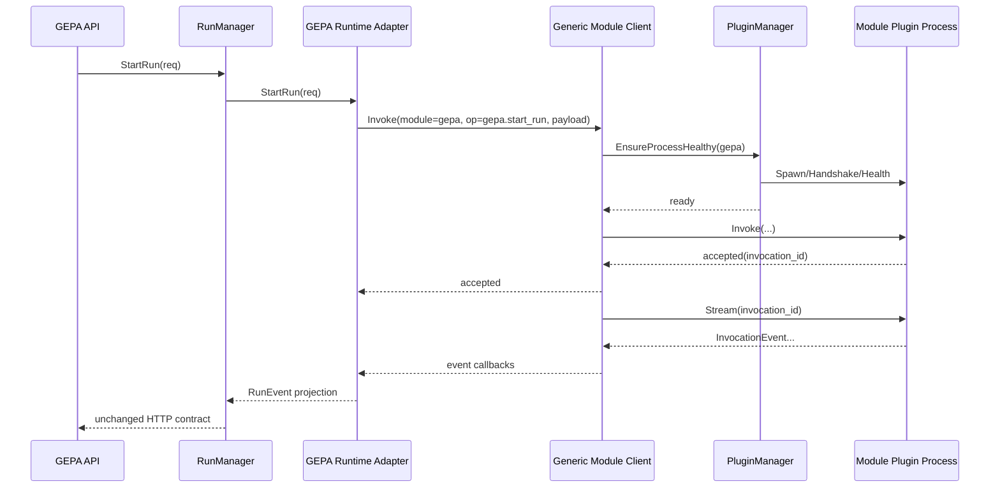

# Backend implementation research: in-process GEPA module and phase-2 extraction

## Executive summary

This document defines a backend-first delivery strategy for exposing `go-go-gepa` in `go-go-os` with minimal rework when later extracting to a generic external module plugin API.

The recommendation is to ship in two stages:

1. **Phase 1 (in-process runtime):** add a `gepa` backend module inside `go-go-os` that directly uses `go-go-gepa` runtime APIs.
2. **Phase 2 (external runtime):** keep the same backend HTTP contract, but swap runtime execution to a generic module-plugin process adapter.

The key design rule is contract stability. If the API, run model, and event envelope are kept stable from day one, frontend and operator workflows are unaffected by phase-2 extraction.

This is intentionally backend-scoped. Frontend can remain static and in-repo during this ticket, consuming the same `resolveApiBase('gepa')` route pattern already used by inventory.

## Problem statement

We need to expose local GEPA JavaScript scripts in OS workflows, run those scripts from the launcher backend, and surface structured run events so the timeline/debug tooling can display run progress.

Today, the backend host in `go-go-os` is modular but statically composed in `main.go`, and GEPA execution is packaged as CLI/runtime components in `go-go-gepa`. There is no existing GEPA backend module in OS, no run supervisor in OS, and no standardized bridge from GEPA plugin events to OS SEM/timeline event streams.

The required outcome is:

- add a backend module (`app_id=gepa`) with namespaced endpoints,
- provide script listing + run lifecycle APIs,
- emit structured events suitable for timeline/debug windows,
- preserve an extraction path to an out-of-process plugin runtime.

## Scope and non-goals

### In scope

- Backend architecture for GEPA integration into `go-go-os`.
- API contract for listing scripts, starting runs, streaming events, reading timeline snapshots, and canceling runs.
- Internal backend interfaces to isolate runtime implementation from transport.
- Event translation rules from GEPA plugin events to SEM/timeline-friendly envelopes.
- Detailed task plan for phase 1 and phase 2.

### Out of scope

- Full dynamic frontend module federation rollout.
- Full process plugin framework implementation details beyond backend contract requirements.
- Multi-tenant auth model or remote execution scheduling.

## Current-state architecture evidence

## 1) Backend module host already exists and is strong

`go-go-os` already defines a reusable backend module contract.

```go
// go-go-os/go-inventory-chat/internal/backendhost/module.go
// (simplified)
type AppBackendModule interface {
    Manifest() AppBackendManifest
    MountRoutes(mux *http.ServeMux) error
    Init(ctx context.Context) error
    Start(ctx context.Context) error
    Stop(ctx context.Context) error
    Health(ctx context.Context) error
}
```

Important properties:

- App ID validation and uniqueness are enforced by `NewModuleRegistry(...)`.
- Startup performs `Init` then `Start`, then required module health checks.
- Stop is reverse-order.
- Route mounting is enforced under `/api/apps/<app-id>`.
- Legacy root aliases such as `/chat`, `/ws`, `/api/timeline` are explicitly forbidden.

Evidence:

- `internal/backendhost/module.go:8-25`
- `internal/backendhost/registry.go:14-37`
- `internal/backendhost/lifecycle.go:23-63`
- `internal/backendhost/routes.go:12-67`
- `internal/backendhost/backendhost_test.go:50-127`

## 2) Inventory backend module is the best template

`inventory_backend_module.go` already demonstrates exactly what a GEPA module should emulate:

- `Manifest()` returns app metadata + capabilities.
- `MountRoutes()` registers chat/ws/timeline/profile routes under the namespaced mount root.
- `Health()` validates module readiness.

Evidence:

- `cmd/go-go-os-launcher/inventory_backend_module.go:45-129`
- startup composition in `cmd/go-go-os-launcher/main.go:188-218`
- integration test coverage in `main_integration_test.go:169-195` and `:387-415`

## 3) GEPA runtime contracts are already structured

`go-go-gepa` already provides runtime primitives we can reuse:

- Promise-aware JS calls with timeout and deterministic error propagation.
- Plugin descriptor validation (`apiVersion`, `kind`, `id`, `name`, `create`).
- Structured event emission (`jsbridge.Event`) with `kind`, `sequence`, `timestamp`, `type`, `level`, `message`, and payload/data.

Evidence:

- Promise resolution: `pkg/jsbridge/call_and_resolve.go:14-191`
- Event shape + emitter: `pkg/jsbridge/emitter.go:10-88`
- optimizer plugin loading + event hooks: `cmd/gepa-runner/plugin_loader.go:50-347`
- dataset plugin loading + event hooks: `pkg/dataset/generator/plugin_loader.go:55-178`
- stream CLI wire format: `cmd/gepa-runner/plugin_stream.go:13-33`

## 4) OS timeline/debug ingestion behavior is already suitable

Frontend runtime can already hydrate timeline snapshots and process stream envelopes:

- WS connection manager buffers frames until hydrate is complete.
- Timeline snapshots are fetched via `/api/timeline?conv_id=...` (relative to app base prefix).
- `timeline.upsert` handlers update timeline entities.

Evidence:

- `packages/engine/src/chat/ws/wsManager.ts:95-312`
- `packages/engine/src/chat/runtime/http.ts:84-103`
- `packages/engine/src/chat/sem/semRegistry.ts:320-330`

This means backend needs to emit compatible envelopes/events and provide snapshot endpoints, not invent new frontend state machinery.

## Architectural strategy

## Decision: contract-first adapter layering

Implement `gepa` backend as an adapter over a `GepaRuntime` interface. Start with `InProcessGepaRuntime` and later add `PluginProcessGepaRuntime` without changing HTTP routes.

### Invariants

- OS route namespace remains `/api/apps/gepa/*`.
- Run IDs are backend-generated and stable across all endpoints.
- Event envelope schema remains stable from phase 1 to phase 2.
- Timeline snapshot endpoint remains stable (`/runs/{run_id}/timeline`).
- Cancellation semantics remain best-effort and idempotent.

## Target backend architecture (phase 1)



### Core components

- **ScriptCatalog**: enumerates local JS scripts and descriptor metadata.
- **RunManager**: run lifecycle (`queued`, `running`, `completed`, `failed`, `canceled`) and cancellation.
- **GepaRuntime**: execution abstraction (phase 1 in-process, phase 2 external plugin process).
- **EventTranslator**: converts GEPA `jsbridge.Event` into normalized run events and SEM-like timeline entries.
- **TimelineProjectionStore**: stores per-run timeline entities and snapshot order.

## API contract (stable across phase 1 and phase 2)

## Endpoint summary

- `GET /api/apps/gepa/scripts`
- `POST /api/apps/gepa/runs`
- `GET /api/apps/gepa/runs/{run_id}`
- `GET /api/apps/gepa/runs/{run_id}/events` (SSE)
- `GET /api/apps/gepa/runs/{run_id}/timeline`
- `POST /api/apps/gepa/runs/{run_id}/cancel`

## API signatures (Go)

```go
type GepaAPIServer interface {
    ListScripts(w http.ResponseWriter, r *http.Request)
    StartRun(w http.ResponseWriter, r *http.Request)
    GetRun(w http.ResponseWriter, r *http.Request)
    StreamRunEvents(w http.ResponseWriter, r *http.Request)
    GetRunTimeline(w http.ResponseWriter, r *http.Request)
    CancelRun(w http.ResponseWriter, r *http.Request)
}
```

```go
type GepaRuntime interface {
    ListScripts(ctx context.Context, req ListScriptsRequest) (ListScriptsResult, error)
    StartRun(ctx context.Context, req StartRunRequest, sink EventSink) (StartRunResult, error)
    CancelRun(ctx context.Context, req CancelRunRequest) error
    Health(ctx context.Context) error
}
```

### `GET /scripts` response

```json
{
  "scripts": [
    {
      "id": "toy_math_optimizer",
      "name": "Toy Math Optimizer",
      "kind": "optimizer",
      "apiVersion": "gepa.optimizer/v1",
      "path": "cmd/gepa-runner/scripts/toy_math_optimizer.js",
      "registryIdentifier": "local",
      "hash": "sha256:..."
    }
  ]
}
```

### `POST /runs` request

```json
{
  "scriptId": "toy_math_optimizer",
  "mode": "candidate_run",
  "profile": "gpt-5-nano",
  "configPath": "/abs/path/candidate-run.yaml",
  "inputPath": "/abs/path/input.json",
  "stream": true,
  "tags": {
    "source": "os-gepa"
  }
}
```

### `POST /runs` response

```json
{
  "runId": "gepa-run-20260227-001",
  "status": "running",
  "startedAtMs": 1772235000000,
  "script": {
    "id": "toy_math_optimizer",
    "kind": "optimizer",
    "registryIdentifier": "local"
  }
}
```

### SSE event frame format

Event stream media type: `text/event-stream`.

```text
event: run.event
data: {"runId":"gepa-run-...","seq":12,"type":"gepa.plugin.event","timestampMs":1772235...,"level":"info","message":"row-start","payload":{"index":0}}

```

### Timeline snapshot response

```json
{
  "runId": "gepa-run-20260227-001",
  "version": 3,
  "entities": [
    {
      "id": "evt-12",
      "kind": "gepa_event",
      "createdAt": 1772235001234,
      "props": {
        "type": "candidate-start",
        "message": "candidate started",
        "plugin": "toy_math_optimizer"
      }
    }
  ]
}
```

## Error model

Use a uniform JSON error shape:

```json
{
  "error": {
    "code": "script_not_found",
    "message": "script id toy_math_optimizer not found",
    "details": {"scriptId": "toy_math_optimizer"}
  }
}
```

Common codes:

- `invalid_request`
- `script_not_found`
- `unsupported_mode`
- `run_not_found`
- `run_not_running`
- `runtime_unavailable`
- `internal_error`

## Internal data model

## Run model

```go
type RunStatus string

const (
    RunQueued    RunStatus = "queued"
    RunRunning   RunStatus = "running"
    RunCompleted RunStatus = "completed"
    RunFailed    RunStatus = "failed"
    RunCanceled  RunStatus = "canceled"
)

type RunRecord struct {
    RunID         string
    ScriptID      string
    ScriptKind    string
    Profile       string
    Mode          string
    Status        RunStatus
    StartedAtMS   int64
    FinishedAtMS  int64
    ErrorMessage  string
    OutputSummary map[string]any
}
```

## Event model

```go
type RunEvent struct {
    RunID        string
    Sequence     int64
    TimestampMS  int64
    Type         string
    Level        string
    Message      string
    PluginID     string
    PluginMethod string
    Payload      any
    Data         any
}
```

## Timeline projection model

```go
type TimelineEntity struct {
    ID        string
    Kind      string
    CreatedAt int64
    Props     map[string]any
}

type TimelineSnapshot struct {
    RunID    string
    Version  int64
    Entities []TimelineEntity
}
```

## Event translation contract

GEPA plugin events (`jsbridge.Event`) should map to internal run events and timeline entities deterministically.

### Mapping table

| GEPA source field | RunEvent field | Timeline props field |
|---|---|---|
| `sequence` | `sequence` | `seq` |
| `timestamp_ms` | `timestamp_ms` | `ts` |
| `plugin_id` | `plugin_id` | `pluginId` |
| `plugin_method` | `plugin_method` | `pluginMethod` |
| `type` | `type` | `type` |
| `level` | `level` | `level` |
| `message` | `message` | `message` |
| `payload` | `payload` | `payload` |
| `data` | `data` | `data` |

### Canonical event types

- `gepa.run.started`
- `gepa.plugin.event`
- `gepa.run.completed`
- `gepa.run.failed`
- `gepa.run.canceled`

### Translator pseudocode

```pseudo
onRuntimeEvent(runID, jsEvent):
  ev := RunEvent{
    runID: runID,
    sequence: jsEvent.sequence,
    timestampMS: jsEvent.timestamp_ms,
    type: coalesce(jsEvent.type, "gepa.plugin.event"),
    level: coalesce(jsEvent.level, "info"),
    message: jsEvent.message,
    pluginID: jsEvent.plugin_id,
    pluginMethod: jsEvent.plugin_method,
    payload: jsEvent.payload,
    data: jsEvent.data,
  }

  eventStore.append(runID, ev)

  entity := TimelineEntity{
    id: fmt("evt-%d", ev.sequence),
    kind: "gepa_event",
    createdAt: ev.timestampMS,
    props: {
      "type": ev.type,
      "level": ev.level,
      "message": ev.message,
      "pluginId": ev.pluginID,
      "pluginMethod": ev.pluginMethod,
      "payload": ev.payload,
      "data": ev.data,
    },
  }

  timelineStore.upsert(runID, entity)
  sseHub.publish(runID, ev)
```

## Run lifecycle design

## Execution flow (phase 1)



## Concurrency and backpressure

- Each run gets a buffered event channel.
- SSE clients subscribe per run ID.
- Event store persists recent events for replay (`last N` or full run).
- If no subscribers exist, events still go to store/timeline projection.
- Terminal status update is atomic (`running -> completed/failed/canceled`).

## Cancellation semantics

- `POST /runs/{id}/cancel` is idempotent.
- If run is not running, return `409 run_not_running` or `200` with current status (choose and document one policy).
- Runtime adapter must observe context cancellation.
- Terminal event `gepa.run.canceled` always emitted when cancellation succeeds.

## Detailed backend interfaces (reference)

```go
type StartRunRequest struct {
    RunID      string
    ScriptID   string
    Mode       string // candidate_run | dataset_generate
    Profile    string
    ConfigPath string
    InputPath  string
    Tags       map[string]any
}

type StartRunResult struct {
    RunID       string
    StartedAtMS int64
}

type EventSink func(RunEvent)
```

```go
type RunStore interface {
    Create(ctx context.Context, rec RunRecord) error
    UpdateStatus(ctx context.Context, runID string, status RunStatus, errMsg string) error
    Get(ctx context.Context, runID string) (RunRecord, error)
    List(ctx context.Context, filter RunFilter) ([]RunRecord, error)
}

type EventStore interface {
    Append(ctx context.Context, runID string, ev RunEvent) error
    List(ctx context.Context, runID string, afterSeq int64, limit int) ([]RunEvent, error)
}

type TimelineStore interface {
    Upsert(ctx context.Context, runID string, entity TimelineEntity) error
    Snapshot(ctx context.Context, runID string) (TimelineSnapshot, error)
}
```

## Suggested package/file layout for phase 1

Inside `go-go-os/go-inventory-chat` (or whichever backend host package is active):

- `internal/gepa/module.go` (implements `AppBackendModule`)
- `internal/gepa/api_handlers.go`
- `internal/gepa/runtime_interface.go`
- `internal/gepa/runtime_inprocess.go`
- `internal/gepa/run_manager.go`
- `internal/gepa/event_translator.go`
- `internal/gepa/stores_memory.go` (initial in-memory stores)
- `internal/gepa/types.go`
- `internal/gepa/module_test.go`
- `internal/gepa/run_manager_test.go`
- `internal/gepa/api_handlers_test.go`
- `cmd/go-go-os-launcher/main.go` (register new module)

## Phase 1 implementation plan (in-process)

## Phase 1A: baseline contracts and in-memory stores

Goals:

- Define runtime/store interfaces.
- Define API DTOs and validation.
- Implement in-memory run/event/timeline stores.

Deliverables:

- compile-ready backend package with tests for stores and DTO validation.

## Phase 1B: in-process runtime adapter

Goals:

- Bridge to `go-go-gepa` runtime primitives.
- Support `candidate_run` and `dataset_generate` modes.
- Emit normalized `RunEvent` objects through event sink.

Implementation notes:

- Reuse event sink wiring pattern from `newCommandEventSink` semantics.
- Do not parse CLI stream text; consume structured event callbacks directly.
- Honor Promise timeout semantics inherited from `jsbridge.CallAndResolve`.

## Phase 1C: RunManager + SSE hub

Goals:

- Manage run lifecycle and cancellation.
- Persist events and timeline entities.
- Stream events through SSE endpoint.

Deliverables:

- deterministic state transitions,
- subscriber fanout,
- replay support via `afterSeq` query parameter.

## Phase 1D: HTTP handlers + module wiring

Goals:

- Add all `/api/apps/gepa/*` endpoints.
- Register module in `main.go` module registry.
- Add capability metadata for `/api/os/apps`.

Capabilities recommendation:

- `scripts`
- `run`
- `events`
- `timeline`
- `cancel`

## Phase 1E: integration tests

Required tests:

- module registration appears in `/api/os/apps`.
- namespaced route policy only (`/api/apps/gepa/*` exists, root aliases absent).
- start run returns run ID and running status.
- event stream emits plugin events and terminal status.
- timeline snapshot reflects projected entities.
- cancel endpoint transitions running run to canceled.

## Phase 2 design: external plugin runtime extraction

Phase 2 is not a backend API redesign. It is a runtime implementation swap onto a **generic go-go-os external module API** that all backend modules can use.

## Target architecture (phase 2)



## Generic external module API requirements

Regardless of framework, the host/plugin process contract should be module-agnostic and support:

- handshake with `module_id`, protocol version, and capabilities,
- health check and restart policy,
- generic invocation (`operation` + structured payload),
- streamed invocation events keyed by `invocation_id`,
- generic cancellation by `invocation_id`,
- deterministic error envelope,
- graceful process shutdown semantics.

This API is for **all** `go-go-os` modules. GEPA should be one consumer of that generic contract.

### Minimal generic RPC surface (pseudo IDL)

```text
service OsModulePluginRuntime {
  rpc Handshake(HandshakeRequest) returns (HandshakeResponse)
  rpc Health(HealthRequest) returns (HealthResponse)
  rpc Invoke(InvokeRequest) returns (InvokeAccepted)
  rpc Stream(InvocationStreamRequest) returns (stream InvocationEvent)
  rpc Cancel(InvocationCancelRequest) returns (InvocationCancelResponse)
}
```

```text
HandshakeRequest {
  host_version: string
  protocol_version: string
  module_id: string
}

HandshakeResponse {
  protocol_version: string
  module_id: string
  capabilities: [string]
  operations: [string]
}

InvokeRequest {
  invocation_id: string
  module_id: string
  operation: string
  payload_json: bytes
  context_json: bytes
}

InvocationEvent {
  invocation_id: string
  seq: int64
  timestamp_ms: int64
  event_type: string
  level: string
  message: string
  payload_json: bytes
}
```

## GEPA mapping on top of generic module API

GEPA remains domain-specific, but it travels over generic operations:

- `gepa.list_scripts`
- `gepa.start_run`
- `gepa.get_run`
- `gepa.get_timeline`
- `gepa.cancel_run`

GEPA event types remain GEPA-specific (`gepa.run.started`, `gepa.plugin.event`, `gepa.run.completed`, etc.) while being transported as generic `InvocationEvent` frames.

### GEPA adapter responsibilities in host process

- map GEPA HTTP DTOs to generic invoke payloads and back,
- map `run_id` to `invocation_id`,
- translate generic stream events into `RunEvent` and timeline projections,
- keep existing GEPA HTTP route contracts unchanged.

## Phase 2 migration steps

1. Implement `PluginProcessModuleRuntimeClient` as a generic host-side client for `OsModulePluginRuntime`.
2. Implement `PluginProcessGepaRuntimeAdapter` that maps `GepaRuntime` calls to generic operations.
3. Add runtime selection config:
   - `os.module.runtime.mode=embedded|plugin-process`
   - `os.module.plugin.dir=<path>`
4. Run the exact same GEPA API/integration tests against both runtime modes.
5. Make plugin-process mode optional first, then default once parity is proven.

## Phase 2 sequence diagram



## Backward compatibility checklist

- Same HTTP route paths.
- Same JSON payload schemas.
- Same run status values.
- Same SSE event shape.
- Same timeline snapshot schema.

If any of these differ, phase 2 is not a safe extraction.

## Testing and validation strategy

## Unit tests

- run state machine transitions and invalid transitions,
- event translation correctness,
- timeline projection ordering/idempotency,
- API validation and error code mapping.

## Integration tests (backend host)

- module lifecycle startup/health/stop,
- `/api/os/apps` includes `gepa` manifest,
- namespaced route mount policy,
- run creation + SSE delivery + timeline query.

## Contract tests

- golden JSON fixtures for all API responses,
- golden SSE frame fixtures,
- deterministic sample runs for both `candidate_run` and `dataset_generate`.

## Dual-runtime parity tests (phase 2 prep)

Run the same suite twice:

- once with `InProcessGepaRuntime`,
- once with generic `PluginProcessModuleRuntimeClient` + `PluginProcessGepaRuntimeAdapter`.

Differences should fail CI.

## Generic module API conformance tests (new)

- handshake validation (`module_id`, protocol version, operations),
- invoke/stream ordering guarantees (`seq` monotonic),
- cancel semantics across modules,
- plugin restart/reconnect behavior and error mapping stability.

## Operational considerations

## Configuration

Recommended backend config keys:

- `GEPA_SCRIPTS_ROOT` (where local scripts are discovered)
- `OS_MODULE_RUNTIME_MODE` (`embedded`, `plugin-process`)
- `OS_MODULE_PLUGIN_DIR` (plugin manifest/binary directory)
- `OS_MODULE_PLUGIN_CMD_TEMPLATE` (optional process command template)
- `GEPA_MAX_CONCURRENT_RUNS`
- `GEPA_EVENT_BUFFER_SIZE`
- `GEPA_RUN_TIMEOUT_MS`

## Resource limits

- enforce per-run timeout,
- cap concurrent runs,
- cap retained events per run (or spill to sqlite if needed),
- reject oversized request payloads.

## Observability

Add backend metrics/log dimensions:

- run counts by status,
- run duration histogram,
- event throughput,
- active SSE subscribers,
- generic plugin process health/restart counts by `module_id`.

## Security and trust boundaries

Phase 1 is local in-process code execution and assumes trusted local scripts.

Phase 2 introduces a process boundary with a generic host/plugin API. Trust is still local by default unless additional signing/sandbox policy is added in a separate ticket.

## Detailed implementation tasks (backend)

This section is intentionally implementation-granular so developers can pick up tasks without prior ticket context.

## Milestone A: module scaffolding

- create `internal/gepa/module.go` implementing `AppBackendModule`.
- define manifest:
  - `AppID = "gepa"`
  - `Required = false` initially
  - capabilities list above.
- register module in `cmd/go-go-os-launcher/main.go` registry creation.
- ensure lifecycle hooks check internal dependencies.

## Milestone B: API + DTO layer

- implement handlers for six endpoints.
- add DTO decode + validation package.
- add error helper with stable `code/message/details` format.
- add `Content-Type: application/json` consistency middleware/helpers.

## Milestone C: runtime adapter + run manager

- implement `InProcessGepaRuntime`.
- implement `RunManager` with goroutine execution supervision.
- wire cancel contexts per run.
- persist run state in store.

## Milestone D: event + timeline pipeline

- implement `EventTranslator`.
- append events to store with monotonic sequence numbers.
- project events to timeline entities.
- implement SSE fanout with replay from `afterSeq`.

## Milestone E: tests + hardening

- unit tests for stores, run manager, translator.
- integration tests for module wiring and endpoints.
- fixture-based test scripts under ticket `scripts/` or package testdata.
- verify no forbidden legacy aliases are introduced.

## Milestone F: phase 2 preparation

- introduce runtime mode switch and interface seam.
- keep all handlers depending only on `GepaRuntime` interface.
- add TODO stubs and contract tests for plugin-process adapter.

## Pseudocode: StartRun handler

```pseudo
handleStartRun(req):
  parsed = decodeAndValidate(req.body)
  runID = runIDGenerator.next()

  runRec = RunRecord{
    runID: runID,
    scriptID: parsed.scriptID,
    mode: parsed.mode,
    status: running,
    startedAtMS: nowMS(),
  }

  runStore.create(runRec)

  go:
    err = runManager.execute(runRec, parsed)
    if err != nil:
      runStore.updateStatus(runID, failed, err.message)
      emitTerminal(runID, "gepa.run.failed", err)
    else:
      runStore.updateStatus(runID, completed, "")
      emitTerminal(runID, "gepa.run.completed", nil)

  return 202 {runId: runID, status: running}
```

## Pseudocode: phase-2 runtime swap

```pseudo
buildRuntime(cfg):
  if cfg.osModuleRuntimeMode == "plugin-process":
    client = NewPluginProcessModuleRuntimeClient(cfg.pluginDir, cfg.pluginLauncher)
    return NewPluginProcessGepaRuntimeAdapter(client)
  return NewInProcessGepaRuntime(cfg.scriptsRoot)
```

The rest of backend code must not care which runtime implementation was selected.

## Alternatives considered

1. **Direct CLI subprocess for every run in phase 1**
   - Pros: fast prototyping.
   - Cons: parsing CLI output couples backend API to text output and makes event semantics brittle.
   - Decision: rejected for core path; consume runtime APIs directly.

2. **Build phase 2 first (external plugin now)**
   - Pros: early isolation.
   - Cons: slower initial delivery, higher protocol and lifecycle complexity before UX validation.
   - Decision: rejected; ship in-process first.

3. **Change API shape during phase 2 extraction**
   - Pros: freedom for plugin protocol details.
   - Cons: forces frontend rewrite and breaks migration promise.
   - Decision: rejected; API must remain stable.

## Risks and mitigations

- **Risk:** run lifecycle race conditions (cancel vs completion).
  - **Mitigation:** single writer transition function + compare-and-set status updates.

- **Risk:** unbounded event memory.
  - **Mitigation:** bounded buffer with configurable retention and optional sqlite spill.

- **Risk:** timeline projection drift between runtimes.
  - **Mitigation:** event translation contract tests and golden fixtures.

- **Risk:** module startup regressions.
  - **Mitigation:** explicit lifecycle tests and health checks in `/api/os/apps`.

## Open questions

- Should run records persist to sqlite from phase 1 or remain memory-only initially?
- Do we require multi-user run ownership metadata now, or defer?
- Which generic module transport should `go-go-os` standardize on for all modules (gRPC stream vs NDJSON stdio)?
- Should `dataset_generate` outputs be exposed as downloadable artifacts from the backend module in phase 1?

## Recommended immediate next steps

1. Approve this API contract as the ticket baseline.
2. Implement Milestones A and B in one PR (scaffolding + endpoints with mock runtime).
3. Implement Milestones C and D in second PR (real runtime + event/timeline flow).
4. Implement Milestone E in third PR (test hardening + docs).
5. Open phase-2 spike ticket for transport selection and plugin process manager implementation.

## References

- `go-go-os/go-inventory-chat/internal/backendhost/module.go`
- `go-go-os/go-inventory-chat/internal/backendhost/routes.go`
- `go-go-os/go-inventory-chat/internal/backendhost/lifecycle.go`
- `go-go-os/go-inventory-chat/cmd/go-go-os-launcher/main.go`
- `go-go-os/go-inventory-chat/cmd/go-go-os-launcher/inventory_backend_module.go`
- `go-go-gepa/pkg/jsbridge/emitter.go`
- `go-go-gepa/pkg/jsbridge/call_and_resolve.go`
- `go-go-gepa/cmd/gepa-runner/plugin_loader.go`
- `go-go-gepa/pkg/dataset/generator/run.go`
- `go-go-os/packages/engine/src/chat/ws/wsManager.ts`
- `go-go-os/packages/engine/src/chat/sem/semRegistry.ts`
