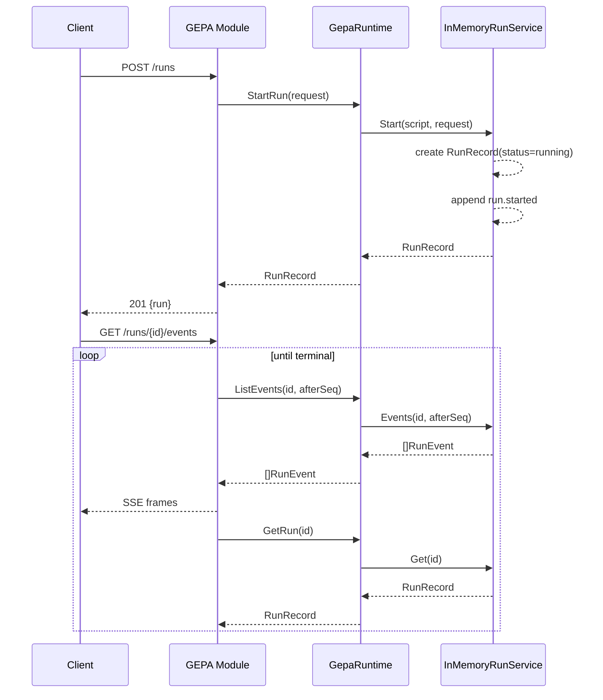

# Phase 1 implementation report and intern onboarding guide

## How to read this guide

This report is written for an intern who is smart, technical, and totally new to this codebase.

The tone is intentionally direct and practical. You should walk away with answers to all of these questions:

- What did we build?
- Why did we build it this way?
- Which files own which responsibilities?
- What API endpoints exist and how do they behave?
- How can I run and test it myself?
- What is complete, what is intentionally placeholder, and what comes next?

If you only have five minutes, read:

1. Executive summary.
2. System map.
3. API reference.
4. Next-step roadmap.

If you are about to implement code, read this entire document once front to back.

## Executive summary

We implemented Phase 1 of GEPA backend integration inside `go-go-os` as an internal backend module.

What that means in plain language:

- GEPA now appears as a first-class backend app module in the launcher host.
- It is mounted under `/api/apps/gepa/*` like other app modules.
- It supports script discovery, run creation, run status lookup, cancellation, event streaming, and timeline projection.
- The module publishes reflection metadata so clients can discover APIs and schemas in a machine-readable way.
- Host-level `/api/os/apps` now advertises which modules provide reflection and where to fetch it.

The implementation is intentionally Phase-1 scoped:

- execution runtime is in-process,
- run execution is currently a controlled in-memory placeholder state machine,
- we have not yet switched to live `go-go-gepa` runner execution,
- the handler layer is already decoupled behind `GepaRuntime` so swapping runtime implementations is straightforward.

In short: we now have a stable, testable backend contract and onboarding-friendly surface. The next major step is replacing the placeholder runtime with real GEPA execution while keeping HTTP contracts stable.

## Problem statement and scope

Before this work, there was no dedicated GEPA backend module surface in `go-go-os`.

That created four practical blockers:

1. No standard way for OS UI or tools to discover local GEPA scripts.
2. No dedicated run API lifecycle (start/get/cancel/events/timeline) for GEPA.
3. No reflection metadata for docs, endpoint contracts, and schema references.
4. No clear migration boundary to move from placeholder execution to real GEPA runner integration.

Phase 1 scope we committed to:

- internal BackendModule integration only,
- no external plugin process protocol yet,
- no frontend federation work yet,
- no breaking changes to existing module host behavior.

Non-goals for this phase:

- complete production execution semantics for every GEPA plugin mode,
- full historical timeline persistence,
- distributed queueing or remote workers,
- protocol negotiation with out-of-process module runtimes.

## System map: where the code lives

Think of the implementation as five layers.

1. Host layer (`internal/backendhost/*`):
- generic module registration and manifest endpoints,
- reflection endpoint plumbing.

2. Module layer (`internal/gepa/module.go`):
- HTTP routes and request/response behavior,
- reflection document authored by module owner.

3. Runtime abstraction layer (`internal/gepa/runtime.go`):
- `GepaRuntime` interface consumed by handlers,
- in-memory runtime adapter implementation.

4. Domain services (`internal/gepa/run_service.go`, `catalog.go`):
- script catalog discovery,
- run state machine,
- in-memory event log and replay.

5. Contract/docs/testing:
- schemas (`schemas.go`),
- module and integration tests,
- README operator runbook.

A compact visual:

```mermaid
flowchart TD
    UI[OS UI / Tooling] --> HOST[/api/os/apps]
    UI --> APP[/api/apps/gepa/*]

    HOST --> BH[backendhost]
    BH --> MOD[GEPA Module]
    MOD --> RT[GepaRuntime interface]
    RT --> IMR[InMemoryRuntime]
    IMR --> CAT[FileScriptCatalog]
    IMR --> RUNS[InMemoryRunService]

    MOD --> REF[/api/os/apps/gepa/reflection]
    MOD --> SCH[/api/apps/gepa/schemas/*]
    MOD --> EVT[/api/apps/gepa/runs/{id}/events]
    MOD --> TML[/api/apps/gepa/runs/{id}/timeline]
```

## What changed: commit-by-commit narrative

This section gives you a chronological map so you can inspect history in order.

### Commit 1: host reflection primitives

Commit: `48763fd`

What changed:

- Added optional host interface for reflective modules.
- Added reflection type definitions at host level.
- Extended `/api/os/apps` with reflection hints.
- Added `/api/os/apps/{app_id}/reflection` endpoint.

Why it matters:

- This created a generic discoverability plane for modules.
- GEPA can expose docs/APIs/schemas without custom one-off plumbing.

### Commit 2: initial internal GEPA module scaffold

Commit: `9231cb8`

What changed:

- Added new package: `internal/gepa`.
- Implemented:
  - script catalog,
  - run manager,
  - route handlers,
  - schema docs,
  - reflection payload.
- Wired GEPA module into launcher module registry.
- Added baseline integration tests.

Why it matters:

- This established the concrete `/api/apps/gepa/*` namespace.
- It provided a full first working backend contract.

### Commit 3: operator documentation

Commit: `7d1c9e7`

What changed:

- Added GEPA routes and curl examples to README.
- Added new launcher flags to runbook guidance.

Why it matters:

- This reduced onboarding friction for manual testing and demos.

### Commit 4: timeout + concurrency guardrails

Commit: `dbe2d60`

What changed:

- Added timeout-based run failure behavior.
- Added max concurrent run enforcement.
- Mapped concurrency failures to HTTP `429`.
- Added flags to configure timeout/concurrency.

Why it matters:

- This prevents runaway behavior and makes module behavior controllable.

### Commit 5: events and timeline endpoints

Commit: `36a4765`

What changed:

- Added SSE event stream endpoint.
- Added timeline projection endpoint.
- Added in-memory ordered event log with replay cursor.

Why it matters:

- This exposed the observability surface needed for timeline-style UI.

### Commit 6: cancel integration coverage

Commit: `1ee7ce3`

What changed:

- Added integration test for cancel semantics across running and terminal states.

Why it matters:

- It prevents subtle regressions in state transition handling.

### Commit 7: runtime interface hardening

Commit: `46efc18`

What changed:

- Added `GepaRuntime` interface.
- Refactored handlers to depend on runtime abstraction.
- Added `InMemoryRuntime` adapter.

Why it matters:

- This is the exact seam needed for next step: replacing in-memory runtime with real `go-go-gepa` runtime.

### Commit 8: run-service race/transition test hardening

Commit: `29618ff`

What changed:

- Added run service unit tests for:
  - completion transitions,
  - cancel race behavior,
  - event replay semantics.

Why it matters:

- This locks core correctness around state/event behavior.

## Backend host reflection: design and behavior

The host remains intentionally additive. Existing consumers of `/api/os/apps` still work.

### New host contract

`ReflectiveAppBackendModule` is optional.

```go
type ReflectiveAppBackendModule interface {
    Reflection(ctx context.Context) (*ModuleReflectionDocument, error)
}
```

Important behavior rule:

- modules can ignore reflection entirely and still be valid modules,
- reflective modules get automatic discoverability hints in manifest output.

### `/api/os/apps` behavior

For each module, host now emits optional `reflection` metadata:

```json
{
  "app_id": "gepa",
  "name": "GEPA",
  "reflection": {
    "available": true,
    "url": "/api/os/apps/gepa/reflection",
    "version": "v1"
  }
}
```

### `/api/os/apps/{app_id}/reflection` behavior

- `200`: module exists and implements reflection,
- `404`: unknown module,
- `501`: module registered but not reflective,
- `500`: module returned nil or runtime error.

This endpoint is intentionally generic for all modules.

## GEPA module anatomy

The primary implementation lives in `internal/gepa/module.go`.

The module satisfies:

- `AppBackendModule` (required host contract),
- `ReflectiveAppBackendModule` (optional discoverability contract).

### `ModuleConfig`

```go
type ModuleConfig struct {
    ScriptsRoots       []string
    EnableReflection   bool
    RunCompletionDelay time.Duration
    RunTimeout         time.Duration
    MaxConcurrentRuns  int
}
```

What these mean:

- `ScriptsRoots`: directories scanned for scripts.
- `EnableReflection`: toggles reflection endpoint payload generation.
- `RunCompletionDelay`: placeholder runtime simulated execution length.
- `RunTimeout`: hard stop for one run.
- `MaxConcurrentRuns`: active run cap.

### Capabilities exposed

GEPA manifest currently advertises:

- `script-runner`
- `events`
- `timeline`
- `schemas`
- `reflection`

Treat this capability list as a high-level feature signal for UI/planning code.

## Runtime architecture: decoupling handlers from execution

The most important structural choice is the runtime seam.

### Interface

`internal/gepa/runtime.go`:

```go
type GepaRuntime interface {
    ListScripts(ctx context.Context) ([]ScriptDescriptor, error)
    StartRun(ctx context.Context, request StartRunRequest) (RunRecord, error)
    GetRun(ctx context.Context, runID string) (RunRecord, bool, error)
    CancelRun(ctx context.Context, runID string) (RunRecord, bool, error)
    ListEvents(ctx context.Context, runID string, afterSeq int64) ([]RunEvent, bool, error)
}
```

### Current implementation

`InMemoryRuntime` composes two services:

- `ScriptCatalog` for discovery,
- `RunService` for lifecycle/events.

This means handler code does not care whether runtime is:

- in-memory,
- in-process live GEPA runner,
- future plugin-process client.

This is exactly what we need to keep HTTP stable while swapping execution internals.

## Script discovery and identity

`internal/gepa/catalog.go` implements `FileScriptCatalog`.

### Discovery rules

- scans configured roots recursively,
- accepts `.js`, `.mjs`, `.cjs`,
- skips directories:
  - `.git`, `node_modules`, `dist`, `build`, `ttmp`.

### Script identity rule

`script_id` is the normalized relative path from root, slash-normalized.

Example:

- file path: `/work/plugins/foo/bar/test.js`
- root: `/work/plugins`
- `script_id`: `foo/bar/test.js`

Why this is good:

- deterministic,
- stable across process restarts,
- human-readable.

## Run state machine and event model

`internal/gepa/run_service.go` contains the run manager.

### Run statuses

- `queued` (reserved but not used in current flow),
- `running`,
- `completed`,
- `failed`,
- `canceled`.

Current flow starts directly in `running` because placeholder execution is immediate.

### Event envelope

```go
type RunEvent struct {
    Seq       int64          `json:"seq"`
    RunID     string         `json:"run_id"`
    Type      string         `json:"type"`
    Timestamp time.Time      `json:"timestamp"`
    Payload   map[string]any `json:"payload,omitempty"`
}
```

Event ordering guarantee:

- each run has monotonic increasing `seq`,
- stored in-memory per run,
- replay uses `afterSeq` cursor.

### Transition behavior highlights

- `Start`:
  - validates concurrency cap,
  - creates run in `running`,
  - appends `run.started`.
- timeout:
  - if still running when timeout hits, marks `failed`, appends `run.failed`.
- completion:
  - if still running when delay timer hits, marks `completed`, appends `run.completed`.
- cancel:
  - if running, marks `canceled`, appends `run.canceled` once.
  - if already terminal, returns current run unchanged.

### Why this matters for correctness

The key invariant is one terminal outcome per run.

A run should not be both completed and canceled. Existing tests assert this around cancel races.

## HTTP API reference

This is the practical endpoint contract interns will use daily.

### Base paths

- Host manifest path: `/api/os/apps`
- Host reflection path: `/api/os/apps/{app_id}/reflection`
- GEPA app base: `/api/apps/gepa`

### 1) List scripts

- Method: `GET`
- Path: `/api/apps/gepa/scripts`
- Success: `200`

Response:

```json
{
  "scripts": [
    {
      "id": "scripts/example.js",
      "name": "example",
      "path": "/abs/path/scripts/example.js"
    }
  ]
}
```

### 2) Start run

- Method: `POST`
- Path: `/api/apps/gepa/runs`
- Success: `201`
- Request schema: `gepa.runs.start.request.v1`

Request:

```json
{
  "script_id": "scripts/example.js",
  "arguments": ["--dry-run"],
  "input": {"foo": "bar"}
}
```

Response:

```json
{
  "run": {
    "run_id": "run-...",
    "script_id": "scripts/example.js",
    "status": "running",
    "created_at": "...",
    "started_at": "...",
    "updated_at": "..."
  }
}
```

Errors:

- `400`: missing/unknown `script_id`, invalid payload,
- `429`: concurrency limit reached,
- `500`: internal runtime error.

### 3) Get run

- Method: `GET`
- Path: `/api/apps/gepa/runs/{run_id}`
- Success: `200`
- Not found: `404`

### 4) Cancel run

- Method: `POST`
- Path: `/api/apps/gepa/runs/{run_id}/cancel`
- Success: `200`
- Not found: `404`

Behavior:

- running run -> `canceled`,
- already terminal run -> returns terminal run as-is.

### 5) Stream run events (SSE)

- Method: `GET`
- Path: `/api/apps/gepa/runs/{run_id}/events`
- Query: `afterSeq` optional cursor

SSE frame style:

```text
id: 1
event: run.started
data: { ... RunEvent JSON ... }

id: 2
event: run.completed
data: { ... RunEvent JSON ... }
```

Semantics:

- returns replay from `afterSeq`,
- ends stream when run reaches terminal state.

### 6) Get run timeline projection

- Method: `GET`
- Path: `/api/apps/gepa/runs/{run_id}/timeline`

Response shape:

```json
{
  "run_id": "run-...",
  "status": "completed",
  "last_seq": 2,
  "last_event": "run.completed",
  "event_count": 2,
  "counts": {
    "run.started": 1,
    "run.completed": 1
  },
  "events": [ ... ]
}
```

### 7) Schema endpoint

- Method: `GET`
- Path: `/api/apps/gepa/schemas/{schema_id}`

Not found behavior:

- unknown schema id -> `404`.

### 8) Reflection endpoint

- Method: `GET`
- Path: `/api/os/apps/gepa/reflection`

Contains:

- capabilities,
- API list,
- schema references,
- docs links.

## Schema reference quick index

These are current schema IDs you will see in reflection:

- `gepa.scripts.list.response.v1`
- `gepa.runs.start.request.v1`
- `gepa.runs.start.response.v1`
- `gepa.runs.get.response.v1`
- `gepa.runs.events.stream.v1`
- `gepa.runs.timeline.response.v1`
- `gepa.error.v1`

Tip for interns: when adding a new endpoint, always add or update schema IDs first, then wire reflection references.

## Launcher integration and configuration

The module is wired in `cmd/go-go-os-launcher/main.go`.

### New flags

- `--gepa-scripts-root`
- `--gepa-run-timeout-seconds`
- `--gepa-max-concurrent-runs`

### Default behavior

- reflection enabled,
- completion delay ~300ms (placeholder runtime),
- timeout and concurrency defaults set for safe local behavior.

### Startup behavior details

`gepa` module is non-required by default.

That means launcher can boot even when GEPA script roots are empty. If roots are configured and invalid, `Health` will report errors when queried.

## Test strategy and what it buys us

### Unit-level tests (`internal/gepa`)

- module route/behavior tests,
- runtime transition and race tests,
- replay semantics tests.

Purpose:

- fast correctness validation for logic-heavy code,
- confidence around edge cases that are hard to reproduce manually.

### Integration-level tests (`cmd/go-go-os-launcher`)

- host manifest includes GEPA,
- reflection endpoint present,
- scripts endpoint mounted,
- run/events/timeline flow working,
- cancel behavior for running and terminal states.

Purpose:

- verify real route mounting and host/module wiring,
- catch regressions caused by launcher glue code.

### Remaining known gap

One unrelated existing launcher test (`TestProfileAPI_CRUDRoutesAreMounted`) had pre-existing instability in broader suite runs. We used targeted GEPA test runs to validate this scope safely.

## Tutorial 1: first run in 10 minutes

This tutorial assumes no prior context.

### Step 1: start launcher

From repo root:

```bash
go run ./go-go-os/go-inventory-chat/cmd/go-go-os-launcher go-go-os-launcher \
  --addr :8091 \
  --inventory-db ./go-go-os/go-inventory-chat/data/inventory.db \
  --timeline-db ./go-go-os/go-inventory-chat/data/webchat-timeline.db \
  --turns-db ./go-go-os/go-inventory-chat/data/webchat-turns.db \
  --gepa-scripts-root "/path/to/local/js/scripts"
```

### Step 2: verify module discovery

```bash
curl -s localhost:8091/api/os/apps | jq '.apps[] | select(.app_id=="gepa")'
```

What to confirm:

- `healthy` field is true,
- `reflection.url` exists.

### Step 3: list scripts

```bash
curl -s localhost:8091/api/apps/gepa/scripts | jq
```

Pick one `id`.

### Step 4: start run

```bash
curl -s -X POST localhost:8091/api/apps/gepa/runs \
  -H 'Content-Type: application/json' \
  -d '{"script_id":"YOUR_SCRIPT_ID"}' | jq
```

Save `run_id`.

### Step 5: inspect status

```bash
curl -s localhost:8091/api/apps/gepa/runs/RUN_ID | jq
```

### Step 6: inspect timeline summary

```bash
curl -s localhost:8091/api/apps/gepa/runs/RUN_ID/timeline | jq
```

### Step 7: replay/stream events

```bash
curl -N localhost:8091/api/apps/gepa/runs/RUN_ID/events
```

## Tutorial 2: understanding `afterSeq`

`afterSeq` is a replay cursor for events.

Pattern:

1. Request events from `afterSeq=0`.
2. Save last returned `seq`.
3. Request again from that seq later.

Example:

```bash
curl -N "localhost:8091/api/apps/gepa/runs/RUN_ID/events?afterSeq=0"
# Suppose last id printed is 2
curl -N "localhost:8091/api/apps/gepa/runs/RUN_ID/events?afterSeq=2"
```

If there are no new events and run is terminal, stream exits quickly.

## Tutorial 3: testing timeout and concurrency behavior

### Timeout demo

Use short timeout:

```bash
go run ./go-go-os/go-inventory-chat/cmd/go-go-os-launcher go-go-os-launcher \
  --addr :8091 \
  --gepa-scripts-root "/path/to/scripts" \
  --gepa-run-timeout-seconds 1
```

Start run and watch:

```bash
curl -s -X POST localhost:8091/api/apps/gepa/runs \
  -H 'Content-Type: application/json' \
  -d '{"script_id":"YOUR_SCRIPT_ID"}' | jq
```

Then query status and timeline for `run.failed` event.

### Concurrency demo

Set low cap:

```bash
--gepa-max-concurrent-runs 1
```

Start one run, then immediately start second run.

Expected:

- first run: `201`,
- second run: `429` with message about concurrency limit.

## API behavior details interns often miss

### 1) `script_id` is catalog-relative

It is not arbitrary user text.

If script lookup fails, start endpoint returns `400 unknown script_id`.

### 2) cancel is idempotent enough for retry loops

Calling cancel repeatedly on terminal run still returns success with terminal record.

This makes client retry logic simpler.

### 3) SSE route is not a forever stream by design

Current endpoint exits when run reaches terminal status.

This is intentional for Phase 1 and keeps behavior predictable.

### 4) timeline endpoint is projection, not source of truth storage

Current timeline response is built from in-memory event log.

No durable persistence guarantee yet.

### 5) reflection is a living contract

When adding/changing endpoints, update reflection docs and schema refs in same PR.

## Pseudocode walkthroughs

### Start run path

```go
handleStartRun(req):
  decode JSON payload
  validate script_id
  run = runtime.StartRun(payload)
  if ErrScriptIDRequired or ErrUnknownScriptID:
    400
  if ErrConcurrencyLimitExceeded:
    429
  else if error:
    500
  return 201 + run
```

### Event stream path

```go
handleRunEvents(req, runID):
  parse afterSeq
  write SSE headers
  loop:
    events = runtime.ListEvents(runID, afterSeq)
    write each as SSE frame
    update afterSeq
    run = runtime.GetRun(runID)
    if run terminal: return
    wait 100ms or context done
```

### Timeline projection path

```go
handleRunTimeline(req, runID):
  run = runtime.GetRun(runID)
  events = runtime.ListEvents(runID, 0)
  counts = aggregate event.Type counts
  return {
    run_id, status,
    last_seq, last_event,
    event_count, counts,
    events
  }
```

## Data flow diagram



## How to safely extend this module

This section is your implementation checklist for future PRs.

### When adding a new endpoint

1. Add handler logic in `module.go`.
2. Add/extend runtime method in `GepaRuntime`.
3. Implement it in current runtime adapter.
4. Add schema document in `schemas.go`.
5. Add reflection API entry and schema reference.
6. Add unit test and integration test.
7. Add README runbook example.

### When changing run state behavior

1. Update run manager transitions.
2. Ensure one terminal event invariant still holds.
3. Update tests in `run_service_test.go`.
4. Validate timeline projection fields still make sense.

### When integrating real `go-go-gepa` runtime

1. Keep `GepaRuntime` interface stable if possible.
2. Add `InProcessGepaRuntime` implementation side-by-side.
3. Make runtime selection configurable.
4. Run same API contract tests against both runtimes.

## Operational troubleshooting guide

### Symptom: `/api/apps/gepa/scripts` returns empty list

Checks:

- verify `--gepa-scripts-root` is set,
- verify path exists and contains `.js/.mjs/.cjs` files,
- verify files are not only inside skipped dirs like `node_modules`.

### Symptom: start run returns `400 unknown script_id`

Checks:

- fetch `/scripts` and copy `id` exactly,
- ensure you are not sending absolute file path as `script_id`.

### Symptom: start run returns `429`

Checks:

- lower run duration or increase `--gepa-max-concurrent-runs`.

### Symptom: run often fails with timeout

Checks:

- increase `--gepa-run-timeout-seconds`.

### Symptom: reflection missing in `/api/os/apps`

Checks:

- module must implement `ReflectiveAppBackendModule`,
- module config must not disable reflection.

### Symptom: events endpoint exits quickly

Checks:

- this is expected once run is terminal,
- use `afterSeq` to replay from earlier position.

## Security and robustness notes

Current phase is local-first and in-process, so threat model is limited, but some guardrails already exist:

- route namespacing under `/api/apps/gepa/*`,
- no legacy alias leakage,
- strict JSON request decode for run start payload,
- explicit concurrency and timeout caps,
- controlled reflection payload shape.

Known limitations to keep in mind:

- in-memory run/event storage is non-durable,
- no auth/authorization layer described here,
- no per-tenant isolation semantics yet.

## What is intentionally placeholder today

This is the most important expectation-setting section.

### Placeholder pieces

- actual script execution body:
  - currently simulated by timer-based completion.
- event payload richness:
  - currently lifecycle-focused (`started/completed/failed/canceled`).
- timeline projection complexity:
  - currently simple aggregation over in-memory events.

### Why this is still valid

The HTTP and reflection contracts are real and stable enough for integration work. Placeholder execution lets teams build UI and orchestration logic before deep runner integration is complete.

## Next-step roadmap: what gets built next

If you are assigned "Phase 1.5" or "Phase 2 prep", this is your queue.

### Next Step A: Real in-process runtime bridge (`go-go-gepa`)

Goal:

- implement `InProcessGepaRuntime` backed by real GEPA execution APIs.

Expected files:

- new runtime adapter in `internal/gepa`.

Definition of done:

- existing endpoints unchanged,
- existing tests mostly unchanged,
- new tests cover real event mapping and failure semantics.

### Next Step B: Event translation hardening

Goal:

- map GEPA runtime event envelopes to `RunEvent` consistently.

Definition of done:

- explicit mapping table documented,
- translation unit tests added,
- no event type drift in timeline output.

### Next Step C: Runtime mode switch

Goal:

- config switch between in-memory and real in-process runtime.

Definition of done:

- one API suite runs against both modes.

### Next Step D: Plugin-process extraction prep
Goal:

- keep handler and reflection layer unchanged,
- replace runtime adapter with plugin-process client later.

Definition of done:

- no route or schema break when swapping runtime backend.

## Intern checklist for first contribution

If you are new and want a safe first task, do this:

1. Run the tutorials and capture one successful run id.
2. Add one small field to timeline response (for example `terminal: true/false`).
3. Update schema and reflection reference.
4. Add unit test and integration assertion.
5. Update README example.
6. Run targeted tests and submit PR.

This gives you contact with every critical layer without requiring deep runtime internals.

## QA checklist for reviewers

When reviewing GEPA backend PRs, use this checklist:

1. Are routes still namespaced under `/api/apps/gepa/*`?
2. Are reflection docs/schema refs updated for any API change?
3. Does run terminal behavior stay single-outcome?
4. Are timeout/concurrency semantics preserved or intentionally changed?
5. Are tests updated at both unit and integration levels?
6. Does README/runbook remain consistent with runtime behavior?

## Quick command reference

### Targeted test commands used during implementation

```bash
cd /home/manuel/workspaces/2026-02-22/add-gepa-optimizer/go-go-os/go-inventory-chat
GOWORK=off go test ./internal/gepa ./internal/backendhost -count=1
GOWORK=off go test ./cmd/go-go-os-launcher -run 'Test(GEPAModule_ReflectionAndScriptsEndpoints|GEPAModule_RunTimelineAndEventsEndpoints|GEPAModule_CancelEndpointRunningAndTerminalRun)$' -count=1
```

### Manual API smoke commands

```bash
curl -s localhost:8091/api/os/apps | jq
curl -s localhost:8091/api/os/apps/gepa/reflection | jq
curl -s localhost:8091/api/apps/gepa/scripts | jq
curl -s -X POST localhost:8091/api/apps/gepa/runs -H 'Content-Type: application/json' -d '{"script_id":"YOUR_SCRIPT_ID"}' | jq
curl -N localhost:8091/api/apps/gepa/runs/RUN_ID/events
curl -s localhost:8091/api/apps/gepa/runs/RUN_ID/timeline | jq
```

## Open questions and decision backlog

These are intentional follow-ups, not bugs.

1. Should run/event storage become durable in Phase 1.5?
2. Should timeline endpoint support filtered projections instead of full event list?
3. Should SSE route support heartbeat frames for long-lived non-terminal runs?
4. Should reflection include explicit semantic versioning per endpoint contract?
5. What exact shape should real GEPA event translation use for `payload` normalization?

## Final orientation summary

You now have a complete internal map:

- host discoverability is in place,
- GEPA backend APIs are in place,
- runtime abstraction seam is in place,
- tests cover key transitions and races,
- docs/runbook are in place.

This is a strong foundation for the next milestone: replacing simulated execution with real `go-go-gepa` runtime execution while preserving external API stability.

If you remember one sentence from this whole report, remember this:

The API surface is now intentionally stable; we can swap runtime internals behind `GepaRuntime` without breaking clients.

## Appendix A: endpoint-by-endpoint deep dive

This appendix is intentionally practical. It is designed for the first week when you are still building intuition and want crisp examples with expected outcomes.

### `GET /api/os/apps`: global module inventory

Request:

```bash
curl -s localhost:8091/api/os/apps | jq
```

When you debug module registration issues, this is your first stop.

What to check for GEPA:

- there is an `apps[]` entry with `app_id: "gepa"`,
- `healthy` is true,
- `reflection.available` exists and is true.

If GEPA is missing here, route debugging under `/api/apps/gepa/*` is pointless until you fix registration.

### `GET /api/os/apps/gepa/reflection`: machine-readable contract

Request:

```bash
curl -s localhost:8091/api/os/apps/gepa/reflection | jq
```

Use this when:

- frontend code needs to discover endpoints,
- you need schema IDs for validation,
- you want to check whether documentation metadata is current.

Reflection payload should include:

- API operation IDs and HTTP methods,
- schema references and URLs,
- capability set.

### `GET /api/apps/gepa/scripts`: script catalog

Request:

```bash
curl -s localhost:8091/api/apps/gepa/scripts | jq
```

Rule of thumb:

- never hardcode a script ID without verifying it appears here first.

Expected shape:

- array of `{id,name,path}` entries.

### `POST /api/apps/gepa/runs`: run creation

Request:

```bash
curl -s -X POST localhost:8091/api/apps/gepa/runs \
  -H 'Content-Type: application/json' \
  -d '{"script_id":"scripts/example.js","arguments":["--dry-run"]}' | jq
```

Important error semantics:

- `400` missing `script_id`,
- `400` unknown `script_id`,
- `429` too many running runs,
- `500` unexpected internal failure.

### `GET /api/apps/gepa/runs/{run_id}`: status polling

Request:

```bash
curl -s localhost:8091/api/apps/gepa/runs/RUN_ID | jq
```

Use this when:

- SSE is unavailable,
- you need an idempotent polling path for simple clients.

### `POST /api/apps/gepa/runs/{run_id}/cancel`: cancellation

Request:

```bash
curl -s -X POST localhost:8091/api/apps/gepa/runs/RUN_ID/cancel | jq
```

Behavior:

- if running, transitions to canceled,
- if already terminal, still returns terminal run.

This behavior is intentionally retry-friendly.

### `GET /api/apps/gepa/runs/{run_id}/events`: SSE stream

Request:

```bash
curl -N localhost:8091/api/apps/gepa/runs/RUN_ID/events
```

Replay form:

```bash
curl -N "localhost:8091/api/apps/gepa/runs/RUN_ID/events?afterSeq=2"
```

SSE frame format:

- `id: <seq>`
- `event: <type>`
- `data: <RunEvent JSON>`

### `GET /api/apps/gepa/runs/{run_id}/timeline`: projection summary

Request:

```bash
curl -s localhost:8091/api/apps/gepa/runs/RUN_ID/timeline | jq
```

This endpoint is very useful for UI summaries and diagnostics because it includes:

- latest status,
- last event and sequence,
- type count aggregation,
- full event list snapshot.

## Appendix B: architecture drill-down mental models

### Model 1: host owns composition, module owns domain

Host-level code answers:

- what modules exist,
- where they are mounted,
- how module health and reflection are exposed.

Module-level code answers:

- what domain operations exist for GEPA,
- what request/response behavior is allowed,
- what reflection metadata accurately describes GEPA.

If a change benefits every module, consider host. If a change is GEPA-specific behavior, keep it in `internal/gepa`.

### Model 2: handlers own transport, runtime owns execution

`module.go` handlers:

- parse HTTP input,
- enforce request-level validation,
- map runtime errors to HTTP status codes,
- format output.

`runtime.go` and run services:

- do domain work,
- own state transitions and event emission.

This split keeps handlers clean and makes runtime swaps feasible.

### Model 3: state transitions are the source of truth for timeline

Timeline and event streaming should reflect authoritative state transitions only.

Current transition rules are intentionally explicit and tested:

- running -> completed emits `run.completed`,
- running -> failed emits `run.failed`,
- running -> canceled emits `run.canceled`.

Terminal event duplication is treated as a correctness bug.

## Appendix C: debugging playbook

### Case 1: GEPA missing from `/api/os/apps`

Actions:

1. Verify module registration in launcher `main.go`.
2. Confirm module registry creation includes `gepaModule`.
3. Restart process and query `/api/os/apps` again.

### Case 2: scripts list empty

Actions:

1. Confirm `--gepa-scripts-root` value.
2. Confirm directories exist and are readable.
3. Confirm scripts are not only inside filtered directories.
4. Confirm extensions are `.js/.mjs/.cjs`.

### Case 3: start run gives `400 unknown script_id`

Actions:

1. Query `/scripts` and copy ID exactly.
2. Verify no path normalization mismatch.
3. Retry with minimal payload.

### Case 4: start run gives `429`

Actions:

1. Query current runs and statuses.
2. Increase `--gepa-max-concurrent-runs` for workload.
3. Ensure terminal runs are not mistaken as active.

### Case 5: timeline missing expected events

Actions:

1. Stream raw events endpoint first.
2. Compare event list with timeline counts.
3. Verify `afterSeq` usage does not skip needed frames.

### Case 6: reflection payload stale after API change

Actions:

1. Update `Reflection()` API list in module.
2. Update schema reference IDs and URLs.
3. Re-run reflection endpoint snapshot manually.

## Appendix D: intern exercises (recommended progression)

### Exercise 1: add one non-breaking timeline field

Goal:

- add `terminal` boolean to timeline response.

Files:

- `internal/gepa/module.go`,
- `internal/gepa/schemas.go`,
- tests.

Learning:

- additive API changes,
- schema and tests synchronization.

### Exercise 2: add one new event type safely

Goal:

- add optional diagnostic event emission (for example `run.observed`).

Learning:

- event sequencing discipline,
- timeline aggregation updates,
- replay behavior awareness.

### Exercise 3: runtime substitution in tests

Goal:

- create fake runtime implementing `GepaRuntime`,
- inject with `NewModuleWithRuntime`.

Learning:

- handler/runtime separation,
- interface-driven test design.

### Exercise 4: improve cancel observability

Goal:

- include cancel reason metadata payload.

Learning:

- event payload evolution,
- schema evolution without breaking old consumers.

## Appendix E: compact API table

| Endpoint | Method | Success | Key errors | Notes |
|---|---|---|---|---|
| `/api/os/apps` | GET | 200 | 405 | Host manifest and reflection hints |
| `/api/os/apps/gepa/reflection` | GET | 200 | 404, 501, 500 | Machine-readable module docs/contracts |
| `/api/apps/gepa/scripts` | GET | 200 | 500 | Discovers script catalog |
| `/api/apps/gepa/runs` | POST | 201 | 400, 429, 500 | Starts run |
| `/api/apps/gepa/runs/{id}` | GET | 200 | 404 | Run status |
| `/api/apps/gepa/runs/{id}/cancel` | POST | 200 | 404 | Cancel semantics are terminal-safe |
| `/api/apps/gepa/runs/{id}/events` | GET | 200 | 400, 404 | SSE stream with replay cursor |
| `/api/apps/gepa/runs/{id}/timeline` | GET | 200 | 404 | Timeline projection summary |
| `/api/apps/gepa/schemas/{schema}` | GET | 200 | 404 | JSON schema docs |

## Appendix F: pre-merge review checklist for GEPA backend PRs

Use this checklist in every review:

1. Namespacing:
   - are all GEPA routes under `/api/apps/gepa/*`?
2. Contracts:
   - were schemas and reflection updated for API changes?
3. State correctness:
   - does code preserve single terminal outcome semantics?
4. Limits:
   - do timeout and concurrency controls remain explicit and tested?
5. Tests:
   - are both unit and integration paths covered for new behavior?
6. Docs:
   - does README runbook match actual endpoint behavior?

## Appendix G: what to read next (ordered onboarding path)

If you finished this report and want to keep going, read files in this order:

1. `internal/gepa/runtime.go`
2. `internal/gepa/run_service.go`
3. `internal/gepa/module.go`
4. `internal/backendhost/manifest_endpoint.go`
5. `cmd/go-go-os-launcher/main.go`
6. `cmd/go-go-os-launcher/main_integration_test.go`

This sequence moves from abstraction and domain mechanics to host composition and end-to-end validation.

## References

- `go-go-os/go-inventory-chat/internal/backendhost/module.go`
- `go-go-os/go-inventory-chat/internal/backendhost/manifest_endpoint.go`
- `go-go-os/go-inventory-chat/internal/gepa/module.go`
- `go-go-os/go-inventory-chat/internal/gepa/runtime.go`
- `go-go-os/go-inventory-chat/internal/gepa/run_service.go`
- `go-go-os/go-inventory-chat/internal/gepa/catalog.go`
- `go-go-os/go-inventory-chat/internal/gepa/schemas.go`
- `go-go-os/go-inventory-chat/internal/gepa/module_test.go`
- `go-go-os/go-inventory-chat/internal/gepa/run_service_test.go`
- `go-go-os/go-inventory-chat/cmd/go-go-os-launcher/main.go`
- `go-go-os/go-inventory-chat/cmd/go-go-os-launcher/main_integration_test.go`
- `go-go-os/go-inventory-chat/README.md`
- `go-go-gepa/ttmp/2026/02/27/GEPA-08-BACKEND-PLUGIN-ROADMAP--backend-roadmap-for-gepa-in-process-integration-and-external-plugin-extraction/design-doc/03-part-1-internal-backendmodule-integration-only.md`
